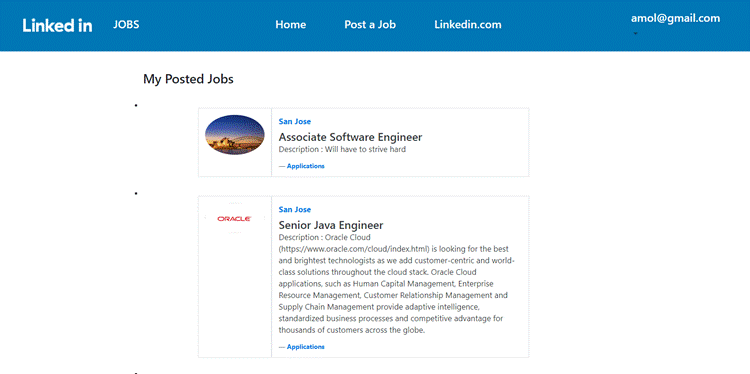
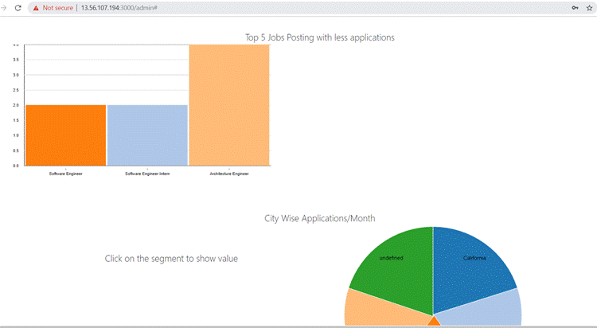

# Linkedin-Simulator

## Goal

* The goal is to build a distributed enterprise web application which enables the applicant to apply for various jobs and recruiter to post jobs. As well as create a dashboard for displaying analytics on user activity.

* We were tasked with this project requirement so that we can learn and develop enterprise MERN stack applications with the use of distributed publish-subscribe messaging system like Apache Kafka along with a variety of other technologies like redis, mocha, etc.

## System Design

 

## Technology stack 

<table>
<thead>
<tr>
<th>Area</th>
<th>Technology</th>
</tr>
</thead>
<tbody>
	<tr>
		<td>Front-End</td>
		<td>React, Redux, React Router, Bootstrap, HTML5, CSS3, Javascript ( ES6 )</td>
	</tr>
	<tr>
		<td>Analytics Graphs</td>
		<td>D3.js</td>
	</tr>
	<tr>
		<td>Message-oriented middleware</td>
		<td>Apache Kafka</td>
	</tr>
	<tr>
		<td>Authentication Middleware</td>
		<td>Passport.js</td>
	</tr>
	<tr>
		<td>Back-End</td>
		<td>Express, Node.js</td>
	</tr>
	<tr>
		<td>In-Memory Caching / Datastore</td>
		<td>Redis</td>
	</tr>
	<tr>
		<td>API Testing</td>
		<td>Mocha, Postman</td>
	</tr>
	<tr>
		<td>Performance Testing</td>
		<td>JMeter</td>
	</tr>
	<tr>
		<td>Database</td>
		<td>MySQL (Amazon RDS), MongoDB </td>
	</tr>
</tbody>
</table>
 

## Screenshots

## Login/Signup

 

 

## User Profile

  

## Jobs Search and Apply

 

## Network

 

 

 

## Chat

 

#### Post Jobs

 

## View Posted Jobs

 

## User Analytics

 

